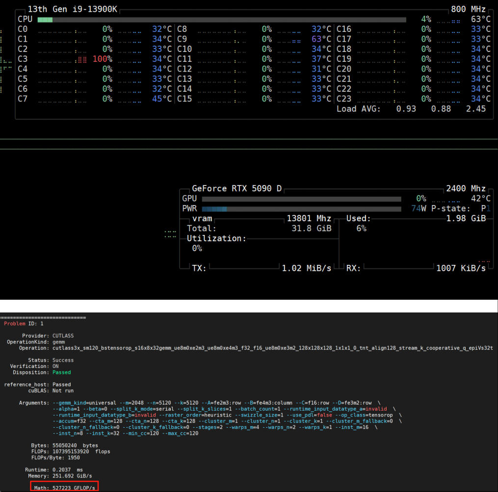
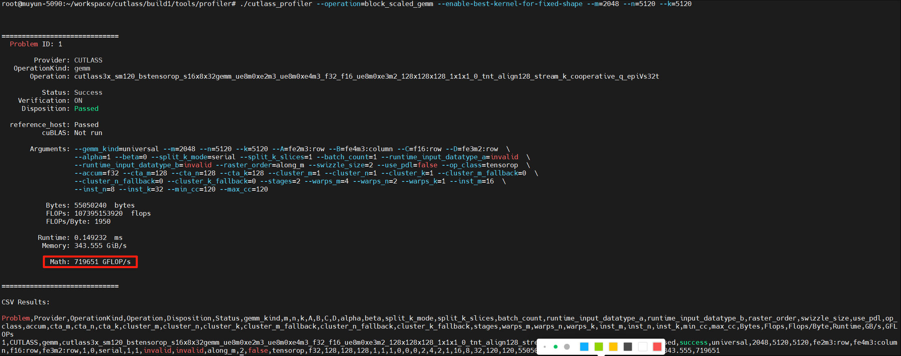

# 5090/5090D 差别对比

## 结论:普通玩家,普通炼丹师,5090d性价比更高  
90d确实只砍了tensorcore(以cutlass issure中profiler特定算子的结果对比)-->[5090d算子计算吞吐结果](https://github.com/NVIDIA/cutlass/issues/2186)  
5090d算子吞吐结果如下:

5090同算子吞吐结果如下:


**以上述结果推算:**  
老黄ppt中90和90d,tensor core差距为3352 TOPS/2375 TOPS = 1.41136842  
上述数据中算子调用在tensor core上吞吐性能差距为 719651 GFLOP/s / 527223 GFLOP/s = 1.364984  

**tensorcore上确实有差距,但是光栅以及cuda核心都没砍,一般不优化定制算子是不会手写cutlass优化具体算子的.所以无论是游戏还是小的炼丹需求,还是普通炼丹需求,90d无疑性价比更高.**

介于网上大部分对比测试,不是训vit,就是llm的sft,或者是ollama,基本都没有定制算子,调用不到tensor core,全跑在cuda core上,所以大部分人得出结论90/90d没有差别.这里我给出了调用tensor core后的差别,不过数据相对单一,如果大家有空可以自己编译后自己跑来丰富一下数据.我下面给出大致的编译流程.

## cuda环境
这一步应该大部分炼丹师都能搞定,如果是linux系统直接装了docker拉nv的最新镜像.
本人环境是win11下的wsl里装的,理论上有性能衰减,cuda的安装流程可以参考llama-factory中一个issue的流程-->[wsl2安装cuda环境](https://github.com/hiyouga/LLaMA-Factory/issues/6958)  
具体踩这种坑就不多说了,资料很多,如果只想试试cutlass跑tensor core差异,torch安装那一部分往下的步骤都可以跳过.

## 使用cuda编译cutlass
具体想要自己写自定义算子跑tensor core加速的,建议多看官方repo-->[cutlass](https://github.com/NVIDIA/cutlass)  
clone下最新的cutlass代码后执行如下操作(下属编译参数去掉了cpp模板组合算子优化搜索和测试模块.旨在纯编译这一个算子来对比90以及90d调用tensor core后的算子差异)  
```
    mkdir build && cd build \
    cmake .. \
        -DCUTLASS_NVCC_ARCHS="120a" \
        -DCUTLASS_ENABLE_TESTS=OFF \
        -DCUTLASS_LIBRARY_KERNELS="cutlass3x_sm120_bstensorop_s16x8x32gemm_ue8m0xe2m3_ue8m0xe4m3_f32_f16_ue8m0xe3m2_128x128x128_1x1x1_0_tnt_align128_stream_k_cooperative_q_epiVs32t" \
        -DCUTLASS_UNITY_BUILD_ENABLED=ON

    make cutlass_profiler -j16
    cutlass_profiler --operation=block_scaled_gemm --enable-best-kernel-for-fixed-shape --m=2048 --n=5120 --k=5120
```
喜欢自己动手的也可以自己参照deepseek之前的开源库以及cutlass的例程手写算子测试,写好cuda代码后,cuda编译参考指令如下:
```
nvcc -arch=sm_120a -I /root/workspace/cutlass/include -I /root/workspace/cutlass/examples/common/ -I /root/workspace/cutlass/tools/util/include ./tensorop_canonical.cu -o tensorop
nvcc -arch=sm_120a -I /root/workspace/cutlass/include -I /root/workspace/cutlass/examples/common/ -I /root/workspace/cutlass/tools/util/include ./79c_blackwell_geforce_mixed_mxfp8_mxfp6_bf16_gemm.cu -o gemm_fp8_bf16

./gemm_fp8_bf16 --m=2048 --n=5120 --k=5120
```
**注意:**  
**不过这个的学习成本比较高,不建议轻易入坑.只测试一下两张卡的差别,测一下特定算子的吞吐量就知道了**  
**如果不是想自己试着入坑,不要按照issure中的把-DCUTLASS_LIBRARY_INSTANTIATION_LEVEL -DCUTLASS_ENABLE_TESTS参数打开.**  
**这两参数打开后,cpp模板会自己组合数百万种不同算子size的组合进行编译,不但编译时间很长,且非常消耗内存,我一开始没细看文档,这两个开了,32g内存+120g的swap分区,3天都没编译完**
